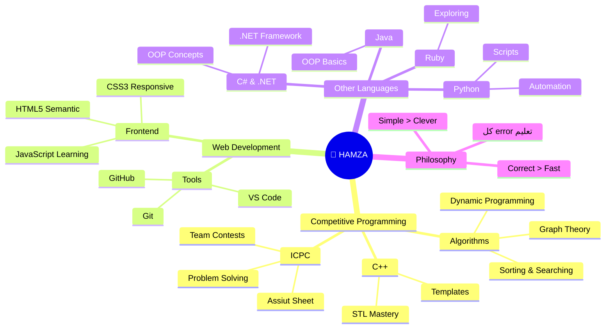
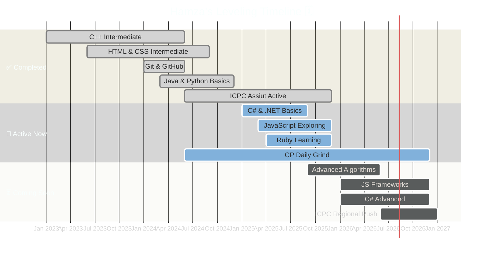

[README (1).md](https://github.com/user-attachments/files/28841433/README.1.md)
<!-- ════════════════════════════════════════════════════════════════════════════════════════ -->
<!--           ██╗  ██╗ █████╗ ███╗   ███╗███████╗ █████╗                               -->
<!--           ██║  ██║██╔══██╗████╗ ████║╚══███╔╝██╔══██╗                              -->
<!--           ███████║███████║██╔████╔██║  ███╔╝ ███████║                              -->
<!--           ██╔══██║██╔══██║██║╚██╔╝██║ ███╔╝  ██╔══██║                              -->
<!--           ██║  ██║██║  ██║██║ ╚═╝ ██║███████╗██║  ██║                              -->
<!--           ╚═╝  ╚═╝╚═╝  ╚═╝╚═╝     ╚═╝╚══════╝╚═╝  ╚═╝                              -->
<!--                    THE ONLY README THAT COMPILES DREAMS                             -->
<!-- ════════════════════════════════════════════════════════════════════════════════════════ -->

<div align="center">


</div>

<!-- ░░░░░░░░░░░░ MATRIX RAIN EFFECT ░░░░░░░░░░░░ -->

<div align="center">

```
01001000 01000001 01001101 01011010 01000001  →  H·A·M·Z·A
```

<picture>
  
</picture>

<br/>


<!-- ░░░░░░░░░░░░ LIVE STATS ROW ░░░░░░░░░░░░ -->


&nbsp;
[](https://github.com/hamza-ahmed26?tab=followers)
&nbsp;
[](https://github.com/hamza-ahmed26)

</div>

<br/>

---

<!-- ░░░░░░░░░░░░ GLITCH BIO SECTION ░░░░░░░░░░░░ -->

<div align="center">

## ░▒▓█ WHO'S THAT CODER? █▓▒░

</div>

<table align="center" width="95%">
<tr>
<td width="55%" valign="top">

```rust
struct Hamza {
    name:       "Hamza Ahmed Kafafi",
    location:   "المنيا، مصر 🇪🇬",
    university: "Minya Uni — Faculty of Science",
    major:      "Information Technology",
    status:     Student::Grinding,
    competing:  vec!["ICPC Assiut", "Codeforces"],
    motto:      "Simple > Clever. Correct > Fast.",
}

impl Hamza {
    fn daily_routine(&self) -> Vec<&str> {
        vec![
            "Wake up",
            "Open Codeforces",
            "Solve problems",
            "Sleep (optional)",
        ]
    }
}
```

</td>
<td width="45%" valign="top">

<br/>

```
╔═══════════════════════════════╗
║    ⚡ TERMINAL: HAMZA OS ⚡    ║
╠═══════════════════════════════╣
║  $ whoami                     ║
║  > hamza-ahmed26              ║
║                               ║
║  $ cat motivation.txt         ║
║  > كل error بتتعلم منها       ║
║  > هي خطوة للأمام             ║
║                               ║
║  $ uptime                     ║
║  > grinding since day one     ║
║                               ║
║  $ status --all               ║
║  > [■■■■■■░░░░] LEVELING UP   ║
╚═══════════════════════════════╝
```

</td>
</tr>
</table>


---

<!-- ░░░░░░░░░░░░ DNA STRAND SECTION ░░░░░░░░░░░░ -->

<div align="center">

## ░▒▓█ MY CODING DNA █▓▒░

```
C++  ──●──●──●──●──●──●──○──○──○──○  60%   COMPETITIVE CORE 
C#   ──●──●──●──●──○──○──○──○──○──○  40%   .NET JOURNEY 
HTML ──●──●──●──●──●──●──○──○──○──○  60%   SEMANTIC MASTER 
CSS  ──●──●──●──●──●──●──○──○──○──○  60%   STYLE ENGINEER 
PY   ──●──●──●──●──○──○──○──○──○──○  35%   SCRIPT WIZARD 
JAVA ──●──●──●──○──○──○──○──○──○──○  30%   OOP EXPLORER 
JS   ──●──●──○──○──○──○──○──○──○──○  25%   UNLOCKING... 
RUBY ──●──●──○──○──○──○──○──○──○──○  20%   FIRST STEPS 
```

</div>

<br/>

<div align="center">

</div>


---

<!-- ░░░░░░░░░░░░ LIVE CODEFORCES ░░░░░░░░░░░░ -->

<div align="center">

## ░▒▓█ LIVE CODEFORCES PULSE █▓▒░

> *🔴 LIVE — Numbers pulled directly from Codeforces API every page load*

<a href="https://codeforces.com/profile/Hamza-Ahmed26">
  
</a>
&nbsp;
<a href="https://codeforces.com/profile/Hamza-Ahmed26">
  
</a>
&nbsp;
<a href="https://codeforces.com/profile/Hamza-Ahmed26">
  
</a>

<br/><br/>

```mermaid
journey
    title Hamza's CP Journey 🗺️
    section Foundations
      Learn C++ basics: 5: Hamza
      First Codeforces submission: 4: Hamza
      First AC: 5: Hamza
    section Growth
      Join ICPC Assiut: 5: Hamza, Team
      Master Data Structures: 4: Hamza
      Crack algorithms: 4: Hamza
    section Now
      Daily problem grind: 5: Hamza
      Exploring web dev: 3: Hamza
      Learning C# & .NET: 4: Hamza
    section Goal
      ICPC Regional: 5: Hamza, Team
      Ship real projects: 5: Hamza
```

</div>


---

<!-- ░░░░░░░░░░░░ ARCHITECTURE MAP ░░░░░░░░░░░░ -->

<div align="center">

## ░▒▓█ KNOWLEDGE ARCHITECTURE █▓▒░

</div>




---

<!-- ░░░░░░░░░░░░ DARK CODE PRINCIPLES ░░░░░░░░░░░░ -->

<div align="center">

## ░▒▓█ THE HAMZA MANIFESTO █▓▒░

</div>

<table align="center" width="85%">
<tr><td>

```
╔══════════════════════════════════════════════════════════════╗
║               ⚡ ARTICLES OF CODE ⚡                         ║
╠══════════════════════════════════════════════════════════════╣
║                                                              ║
║  §01  ما تبعتش كود مش فاهمه                                  ║
║       → Ship nothing you can't explain line by line          ║
║                                                              ║
║  §02  افهم المسألة قبل ما تفتح المحرر                        ║
║       → Read twice. Code once. Debug zero.                   ║
║                                                              ║
║  §03  أبسط حل صح أحسن من أعقد حل ذكي                        ║
║       → O(n log n) you understand > O(n) you don't           ║
║                                                              ║
║  §04  الـ Performance مش extra — هي الأصل                    ║
║       → Write for the judge. Then write for the human.       ║
║                                                              ║
║  §05  كل WA بتتعلم منها هي خطوة للـ AC                       ║
║       → Wrong answer today. Accepted mindset forever.         ║
║                                                              ║
║  §06  ICPC problems = أفضل مدرسة برمجة في العالم             ║
║       → Real school has no leaderboard.                      ║
║                                                              ║
╚══════════════════════════════════════════════════════════════╝
```

</td></tr>
</table>


---

<!-- ░░░░░░░░░░░░ GITHUB METRICS ░░░░░░░░░░░░ -->

<div align="center">

## ░▒▓█ GITHUB METRICS █▓▒░

<picture>
  
</picture>
<picture>
  
</picture>

<br/><br/>


</div>


---

<!-- ░░░░░░░░░░░░ TROPHIES ░░░░░░░░░░░░ -->

<div align="center">

## ░▒▓█ HALL OF TROPHIES █▓▒░

[](https://github.com/ryo-ma/github-profile-trophy)

</div>


---

<!-- ░░░░░░░░░░░░ ROADMAP ░░░░░░░░░░░░ -->

<div align="center">

## ░▒▓█ THE ROADMAP █▓▒░

</div>




---

<!-- ░░░░░░░░░░░░ SNAKE ░░░░░░░░░░░░ -->

<div align="center">

## ░▒▓█ CONTRIBUTION SNAKE █▓▒░

<picture>
  <source media="(prefers-color-scheme: dark)" srcset="https://raw.githubusercontent.com/hamza-ahmed26/hamza-ahmed26/output/github-contribution-grid-snake-dark.svg">
  <source media="(prefers-color-scheme: light)" srcset="https://raw.githubusercontent.com/hamza-ahmed26/hamza-ahmed26/output/github-contribution-grid-snake.svg">
  
</picture>

</div>


---

<!-- ░░░░░░░░░░░░ QUOTE ░░░░░░░░░░░░ -->

<div align="center">

## ░▒▓█ TODAY'S TRANSMISSION █▓▒░


<br/><br/>

```
┌─────────────────────────────────────────────────────────────────┐
│                                                                 │
│   "كن جميلاً ترى الوجود جميلاً"                                │
│    Be beautiful and you'll see the world as beautiful.          │
│                                                                 │
│   "The best time to plant a tree was 20 years ago.             │
│    The second best time is to open Codeforces right now."       │
│                                               — Hamza, probably │
│                                                                 │
└─────────────────────────────────────────────────────────────────┘
```

</div>


---

<!-- ░░░░░░░░░░░░ CONTACT ░░░░░░░░░░░░ -->

<div align="center">

## ░▒▓█ SIGNAL ME █▓▒░

<picture>
  
</picture>

<br/><br/>

<table align="center">
<tr>
<td align="center" width="20%">
<a href="https://github.com/hamza-ahmed26">
<br/>
<b>GitHub</b><br/>
<sub>Code Portfolio</sub>
</a>
</td>
<td align="center" width="20%">
<a href="https://www.linkedin.com/in/hamza-kafafi/">
<br/>
<b>LinkedIn</b><br/>
<sub>Professional</sub>
</a>
</td>
<td align="center" width="20%">
<a href="https://codeforces.com/profile/Hamza-Ahmed26">
<br/>
<b>Codeforces</b><br/>
<sub>CP Arena</sub>
</a>
</td>
<td align="center" width="20%">
<a href="mailto:hamza070626ahmed0195ultmate@gmail.com">
<br/>
<b>Gmail</b><br/>
<sub>Direct Line</sub>
</a>
</td>
<td align="center" width="20%">
<a href="https://x.com/Ham70211Kafafi">
<br/>
<b>X / Twitter</b><br/>
<sub>@Ham70211Kafafi</sub>
</a>
</td>
</tr>
</table>

<br/>

[](https://link.chess.com/friend/ait395)
&nbsp;
[](https://www.reddit.com/user/hamza-ahmed26/)
&nbsp;
[](https://www.tiktok.com/@hamza26_kafafi)

</div>

---

<!-- ░░░░░░░░░░░░ FOOTER ░░░░░░░░░░░░ -->

<div align="center">

```
▓▓▓▓▓▓▓▓▓▓▓▓▓▓▓▓▓▓▓▓▓▓▓▓▓▓▓▓▓▓▓▓▓▓▓▓▓▓▓▓▓▓▓▓▓▓▓▓▓▓▓▓▓▓▓▓▓▓▓▓
  ⚡  ALWAYS LEARNING · ALWAYS BUILDING · ALWAYS GRINDING ⚡
  🇪🇬  المنيا · Minya University · IT Student · ICPC Fighter 🇪🇬
  🧠  Simple > Clever.  Correct > Fast.  Shipped > Perfect. 🧠
▓▓▓▓▓▓▓▓▓▓▓▓▓▓▓▓▓▓▓▓▓▓▓▓▓▓▓▓▓▓▓▓▓▓▓▓▓▓▓▓▓▓▓▓▓▓▓▓▓▓▓▓▓▓▓▓▓▓▓▓
```


</div>
