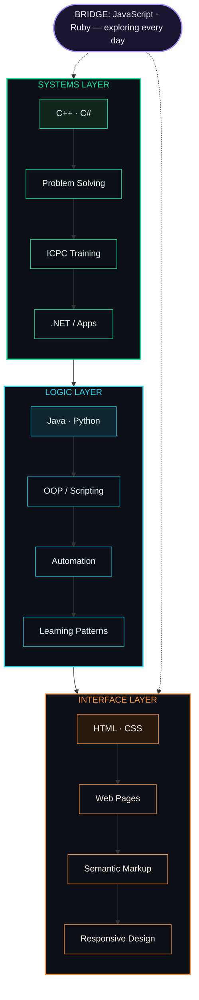
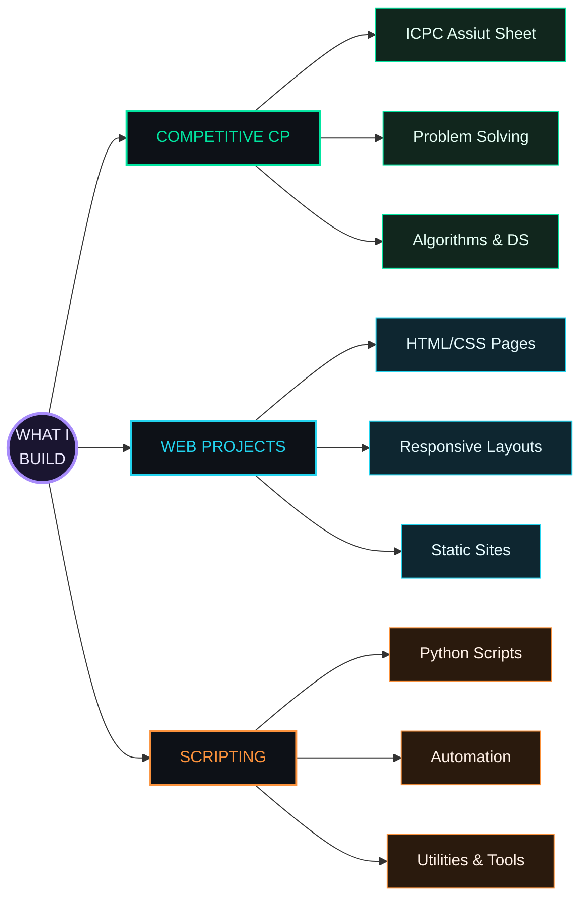
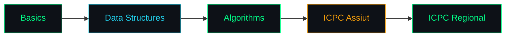

<!-- ════════════════════════════════════════════════════════════════════════════════════════ -->
<!--                          HAMZA AHMED · GITHUB PROFILE                              -->
<!--           Crafted with ⚡ · Always Learning · Always Building                      -->
<!--          Dynamic · Color-Shifting · 3D Language Showcase Edition                   -->
<!-- ════════════════════════════════════════════════════════════════════════════════════════ -->

<div align="center">

<!-- ░░░░░░░░░░░░░░░░░░░░░░░ MEGA ANIMATED NAME ░░░░░░░░░░░░░░░░░░░░░░░░ -->

<a href="https://github.com/hamza-ahmed26">
  
</a>

<!-- ░░░░░░░░░░░░░░░ SECOND COLOR-SHIFTING NAME BANNER ░░░░░░░░░░░░░░░ -->

<picture>
  
</picture>

<br/>

<!-- ░░░░░░░░░░░░░░░░░░░░░░░░░░ TYPING ANIMATION ░░░░░░░░░░░░░░░░░░░░░░░ -->

[](https://github.com/hamza-ahmed26)

<br/>

<!-- ░░░░░░░░░░░░░░░░░░░░░ COLOR-SHIFTING DIVIDER ░░░░░░░░░░░░░░░░░░░░░░ -->


<!-- ░░░░░░░░░░░░░░░░░░░░░░░░░░░░░ BADGES ░░░░░░░░░░░░░░░░░░░░░░░░░░░░░░░ -->


&nbsp;
[](https://github.com/hamza-ahmed26?tab=followers)
&nbsp;
[](https://github.com/hamza-ahmed26)

<br/>

<!-- ░░░░░░░░░░░░░░░░░░░░░░░░ QUICK NAV CHIPS ░░░░░░░░░░░░░░░░░░░░░░░░░░ -->

<a href="#-who-am-i-"></a>
<a href="#-tech-arsenal-"></a>
<a href="#-github-metrics-"></a>
<a href="#-competitive-programming-"></a>
<a href="#-reach-me-"></a>


</div>

---

<div align="center">

## ◈ WHO AM I ◈

</div>

> *"كل error بتتعلم منها هي خطوة للأمام."* — Every error is a step forward.

<table align="center">
<tr>
<td width="50%" valign="top">

```yaml
University:  جامعة المنيا — كلية العلوم 🇪🇬
Major:       Information Technology
Focus:       Competitive Programming
Contest:     ICPC Assiut — Active Participant
```

</td>
<td width="50%" valign="top">

```yaml
Status:      Student · Learning · Building
Grinding:    Codeforces + ICPC Assiut Sheet
Goal:        Ship real projects & solve real problems
Motto:       Simple > clever. Correct > fast.
```

</td>
</tr>
</table>

طالب تقنية معلومات شغوف بحل المسائل البرمجية والـ **Competitive Programming**.
بشتغل على تحسين مهاراتي في `C++` ومتابع شيتات **ICPC أسيوط** — وبتعلم كل يوم حاجة جديدة.

<div align="center">


<br/>


</div>


---

<div align="center">

## ◈ TECH ARSENAL ◈


<br/><br/>


</div>


---

<div align="center">

## ◈ LIVE CODEFORCES PULSE ◈

<p align="center">
  <a href="https://codeforces.com/profile/Hamza-Ahmed26">
    
  </a>
  &nbsp;
  <a href="https://codeforces.com/profile/Hamza-Ahmed26">
    
  </a>
  &nbsp;
  <a href="https://codeforces.com/profile/Hamza-Ahmed26">
    
  </a>
  &nbsp;
  <a href="https://codeforces.com/profile/Hamza-Ahmed26">
    
  </a>
</p>

> 🔴 *الأرقام دي بتتحدّث لايف من Codeforces API — كل مرة الصفحة بتتفتح بتجيب آخر rating.*

</div>


---

<div align="center">

## ◈ DETAILED ARSENAL ◈

</div>

### ⚙️ Systems & Low-Level

<p align="center">
  
</p>

| Language | Proficiency | Use Case |
|----------|------------|----------|
|  **C++** |  | Competitive Programming & Algorithms |
|  **C#** |  | .NET Applications & Learning |

### 🌐 Web & Frontend

<p align="center">
  
</p>

| Language | Proficiency | Use Case |
|----------|------------|----------|
|  **HTML5** |  | Semantic Web Pages |
|  **CSS3** |  | Responsive Design & Styling |
|  **JavaScript** |  | Exploring & Learning |

### 🏢 Other Languages

<p align="center">
  
</p>

| Language | Proficiency | Use Case |
|----------|------------|----------|
|  **Java** |  | Learning OOP Concepts |
|  **Python** |  | Scripts & Automation |
|  **Ruby** |  | Exploring |


---

<div align="center">

## ◈ PARADIGM MAP ◈

</div>



---

<div align="center">

## ◈ WHAT I BUILD ◈

</div>




---

<div align="center">

## ◈ DEVELOPMENT PRINCIPLES ◈

</div>

```
01  ما تبعتش كود مش فاهمه — Never ship code you don't understand
02  الـ Performance مش extra — هي الأصل — Performance is not optional
03  افهم المشكلة قبل ما تكتب سطر واحد — Understand before coding
04  الـ Tests بتوضح الكود أكتر من الـ comments — Tests speak louder
05  أبسط حل صح أحسن من أعقد حل ذكي — Simple beats clever
06  Simple > clever. Correct > fast. Readable > both.
07  كل error بتتعلم منها هي خطوة للأمام — Every error is learning
08  ICPC problems = أفضل مدرسة برمجة — Best programming school
```


---

<div align="center">

## ◈ GITHUB METRICS ◈

<picture>
  <source media="(prefers-color-scheme: dark)" srcset="https://github-readme-stats.vercel.app/api?username=hamza-ahmed26&show_icons=true&theme=chartreuse-dark&hide_border=true&bg_color=0d1117&title_color=00ff88&icon_color=00ff88&text_color=fff">
  
</picture>
<picture>
  <source media="(prefers-color-scheme: dark)" srcset="https://streak-stats.demolab.com/?user=hamza-ahmed26&theme=dark&hide_border=true&background=0d1117&ring=00ff88&fire=00ff88&currStreakLabel=00ff88">
  
</picture>

<br/>


</div>


---

<div align="center">

## ◈ GITHUB TROPHIES ◈

[](https://github.com/ryo-ma/github-profile-trophy)

</div>


---

<div align="center">

## ◈ COMPETITIVE PROGRAMMING ◈

[](https://codeforces.com/profile/Hamza-Ahmed26)

<br/>



> Grinding problems. One AC at a time. 🧠

</div>


---

<div align="center">

## ◈ LEARNING TRAJECTORY ◈

</div>

<table align="center" width="90%">
<tr>
<td width="33%" align="center" valign="top">

**✅ Completed**
```diff
+ C++ (Intermediate)
+ HTML, CSS (Intermediate)
+ Java & Python (Basics)
+ ICPC Assiut — Active
+ Git & GitHub Workflows
```

</td>
<td width="33%" align="center" valign="top">

**🔄 Active**
```yaml
Current:
  - C# & .NET Basics
  - JavaScript (Exploring)
  - Ruby (Learning)
  - Competitive CP grind
```

</td>
<td width="33%" align="center" valign="top">

**⏳ Next**
```javascript
const roadmap = {
  cp: ['Advanced algos'],
  web: ['JS frameworks'],
  systems: ['C# advanced'],
  goal: ['ICPC regional'],
}
```

</td>
</tr>
</table>


---

<div align="center">

## ◈ 3D CONTRIBUTION GRAPH ◈

[](https://github.com/hamza-ahmed26)

</div>

---

<div align="center">

## ◈ CONTRIBUTION SNAKE ◈

<picture>
  <source media="(prefers-color-scheme: dark)" srcset="https://raw.githubusercontent.com/hamza-ahmed26/hamza-ahmed26/output/github-contribution-grid-snake-dark.svg">
  <source media="(prefers-color-scheme: light)" srcset="https://raw.githubusercontent.com/hamza-ahmed26/hamza-ahmed26/output/github-contribution-grid-snake.svg">
  
</picture>

</div>


---

<div align="center">

## ◈ RANDOM DEV QUOTE ◈


</div>


---

<div align="center">

## ◈ REACH ME ◈

<table>
<tr>
<td align="center" width="25%">
<a href="https://github.com/hamza-ahmed26">
<br/>
<b>GitHub</b><br/>
<sub>Code Portfolio</sub>
</a>
</td>
<td align="center" width="25%">
<a href="https://www.linkedin.com/in/hamza-kafafi/">
<br/>
<b>LinkedIn</b><br/>
<sub>Professional Network</sub>
</a>
</td>
<td align="center" width="25%">
<a href="https://codeforces.com/profile/Hamza-Ahmed26">
<br/>
<b>Codeforces</b><br/>
<sub>CP Profile</sub>
</a>
</td>
<td align="center" width="25%">
<a href="mailto:hamza070626ahmed0195ultmate@gmail.com">
<br/>
<b>Email</b><br/>
<sub>Direct Contact</sub>
</a>
</td>
</tr>
</table>

<br/>

[](https://x.com/Ham70211Kafafi)
&nbsp;
[](https://link.chess.com/friend/ait395)
&nbsp;
[](https://www.reddit.com/user/hamza-ahmed26/)
&nbsp;
[](https://www.tiktok.com/@hamza26_kafafi)

<br/>

```
✦  ALWAYS LEARNING · ALWAYS BUILDING · كن جميلاً ترى الوجود جميلاً  ✦
```

<br/>

> *"Build real projects. Learn deeply. Ship it."*

*⚡ المنيا، مصر 🇪🇬 · IT Student · Grinding every day*

<!-- ░░░░░░░░░░░░░░░ COLOR-SHIFTING FOOTER WAVE ░░░░░░░░░░░░░░░ -->


</div>
