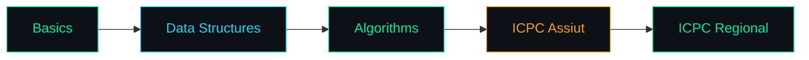
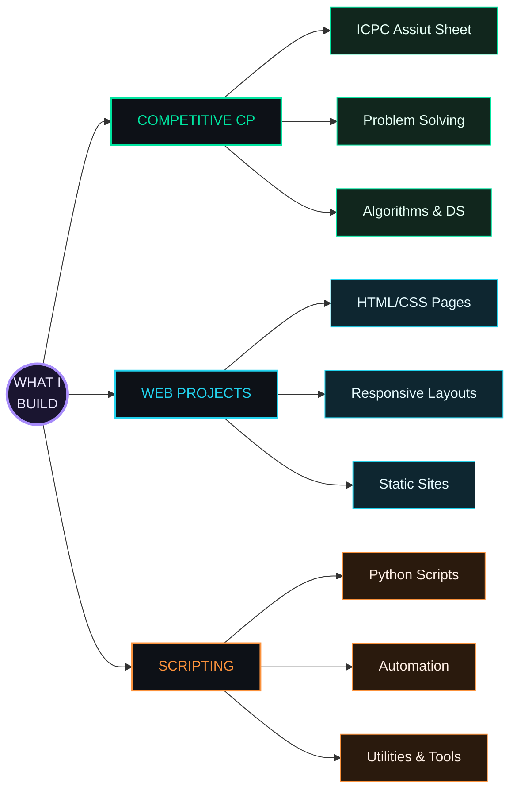

<!-- ============================================================= -->
<!--                      HEADER / BANNER                          -->
<!-- ============================================================= -->

<div align="center">

[](https://github.com/hamza-ahmed26)

<br/>

<a href="https://github.com/hamza-ahmed26">
  
</a>
&nbsp;
<a href="https://github.com/hamza-ahmed26?tab=followers">
  
</a>
&nbsp;
<a href="https://github.com/hamza-ahmed26">
  
</a>

</div>

---

<!-- ============================================================= -->
<!--                         WHO AM I                              -->
<!-- ============================================================= -->

## ◈ WHO AM I ◈

> *"كل error بتتعلم منها هي خطوة للأمام."* — Every error is a step forward.

```yaml
University:  جامعة المنيا — كلية العلوم 🇪🇬
Major:       Information Technology
Focus:       Competitive Programming
Contest:     ICPC Assiut — Active Participant
Status:      Student · Learning · Building
Grinding:    Codeforces + ICPC Assiut Sheet
Goal:        Ship real projects & solve real problems
Motto:       Simple > clever. Correct > fast.
```

طالب تقنية معلومات شغوف بحل المسائل البرمجية والـ **Competitive Programming**.
بشتغل على تحسين مهاراتي في `C++` ومتابع شيتات **ICPC أسيوط** — وبتعلم كل يوم حاجة جديدة.

---

<!-- ============================================================= -->
<!--                       TECH ARSENAL                            -->
<!-- ============================================================= -->

## ◈ TECH ARSENAL ◈

<div align="center">


</div>

---

<!-- ============================================================= -->
<!--                    DETAILED ARSENAL                           -->
<!-- ============================================================= -->

## ◈ DETAILED ARSENAL ◈

### ⚙️ Systems & Low-Level

| Language | Proficiency | Use Case |
|----------|------------|----------|
|  **C++** |  | Competitive Programming & Algorithms |
|  **C#** |  | .NET Applications & Learning |

### 🌐 Web & Frontend

| Language | Proficiency | Use Case |
|----------|------------|----------|
|  **HTML5** |  | Semantic Web Pages |
|  **CSS3** |  | Responsive Design & Styling |
|  **JavaScript** |  | Exploring & Learning |

### 🧩 Other Languages

| Language | Proficiency | Use Case |
|----------|------------|----------|
|  **Java** |  | Learning OOP Concepts |
|  **Python** |  | Scripts & Automation |
|  **Ruby** |  | Exploring |

---

<!-- ============================================================= -->
<!--                       GITHUB METRICS                          -->
<!--   FIXED: consistent theme, fixed sizes, working endpoints     -->
<!-- ============================================================= -->

## ◈ GITHUB METRICS ◈

<div align="center">

<!-- Stats + Streak side by side, height-matched -->
<a href="https://github.com/hamza-ahmed26">
  
</a>
<a href="https://github.com/hamza-ahmed26">
  
</a>

<br/><br/>

<!-- Top Languages, centered and same visual width -->
<a href="https://github.com/hamza-ahmed26">
  
</a>

</div>

> 🛈 *لو ظهرت صورة "broken" — الـ widget بيكون rate-limited مؤقتًا، اعمل refresh للصفحة بعد دقيقة. الـ `cache_seconds` بيقلل المشكلة دي.*

---

## ◈ ACTIVITY GRAPH ◈

<div align="center">


</div>

---

## ◈ GITHUB TROPHIES ◈

<div align="center">

[](https://github.com/ryo-ma/github-profile-trophy)

</div>

---

<!-- ============================================================= -->
<!--                  COMPETITIVE PROGRAMMING                      -->
<!-- ============================================================= -->

## ◈ COMPETITIVE PROGRAMMING ◈

<div align="center">

[](https://codeforces.com/profile/Hamza-Ahmed26)

</div>



> Grinding problems. One AC at a time. 🧠

---

<!-- ============================================================= -->
<!--                       PARADIGM MAP                            -->
<!-- ============================================================= -->

## ◈ PARADIGM MAP ◈


---

<!-- ============================================================= -->
<!--                       WHAT I BUILD                            -->
<!-- ============================================================= -->

## ◈ WHAT I BUILD ◈



---

<!-- ============================================================= -->
<!--                  DEVELOPMENT PRINCIPLES                       -->
<!-- ============================================================= -->

## ◈ DEVELOPMENT PRINCIPLES ◈

```
01  ما تبعتش كود مش فاهمه — Never ship code you don't understand
02  الـ Performance مش extra — هي الأصل — Performance is not optional
03  افهم المشكلة قبل ما تكتب سطر واحد — Understand before coding
04  الـ Tests بتوضح الكود أكتر من الـ comments — Tests speak louder
05  أبسط حل صح أحسن من أعقد حل ذكي — Simple beats clever
06  Simple > clever. Correct > fast. Readable > both.
07  كل error بتتعلم منها هي خطوة للأمام — Every error is learning
08  ICPC problems = أفضل مدرسة برمجة — Best programming school
```

---

<!-- ============================================================= -->
<!--                   LEARNING TRAJECTORY                         -->
<!-- ============================================================= -->

## ◈ LEARNING TRAJECTORY ◈

<table>
<tr>
<td valign="top" width="33%">

**✅ Completed**
```diff
+ C++ (Intermediate)
+ HTML, CSS (Intermediate)
+ Java & Python (Basics)
+ ICPC Assiut — Active
+ Git & GitHub Workflows
```

</td>
<td valign="top" width="33%">

**🔄 Active**
```yaml
Current:
  - C# & .NET Basics
  - JavaScript (Exploring)
  - Ruby (Learning)
  - Competitive CP grind
```

</td>
<td valign="top" width="33%">

**⏳ Next**
```javascript
const roadmap = {
  cp: ['Advanced algos'],
  web: ['JS frameworks'],
  systems: ['C# advanced'],
  goal: ['ICPC regional'],
}
```

</td>
</tr>
</table>

---

<!-- ============================================================= -->
<!--                    CONTRIBUTION SNAKE                         -->
<!-- ============================================================= -->

## ◈ CONTRIBUTION SNAKE ◈

<div align="center">

<picture>
  <source media="(prefers-color-scheme: dark)" srcset="https://raw.githubusercontent.com/hamza-ahmed26/hamza-ahmed26/output/github-snake-dark.svg" />
  <source media="(prefers-color-scheme: light)" srcset="https://raw.githubusercontent.com/hamza-ahmed26/hamza-ahmed26/output/github-snake.svg" />
  
</picture>

</div>

> ⚙️ *الـ snake محتاج GitHub Action — شوف ملف `.github/workflows/snake.yml` تحت لو لسه مش مفعّل.*

---

<!-- ============================================================= -->
<!--                     RANDOM DEV QUOTE                          -->
<!-- ============================================================= -->

## ◈ RANDOM DEV QUOTE ◈

<div align="center">


</div>

---

<!-- ============================================================= -->
<!--                         REACH ME                              -->
<!-- ============================================================= -->

## ◈ REACH ME ◈

<div align="center">

[](https://github.com/hamza-ahmed26)
&nbsp;
[](https://www.linkedin.com/)
&nbsp;
[](https://codeforces.com/profile/Hamza-Ahmed26)
&nbsp;
[](mailto:your-email@example.com)

<br/>

[](https://x.com/Ham70211Kafafi)
&nbsp;
[](https://link.chess.com/friend/ait395)
&nbsp;
[](https://www.reddit.com/user/hamza-ahmed26/)
&nbsp;
[](https://www.tiktok.com/@hamza26_kafafi)

</div>

---

<div align="center">

```
✦  ALWAYS LEARNING · ALWAYS BUILDING · كن جميلاً ترى الوجود جميلاً  ✦
```

> *"Build real projects. Learn deeply. Ship it."*

*⚡ المنيا، مصر 🇪🇬 · IT Student · Grinding every day*


</div>
