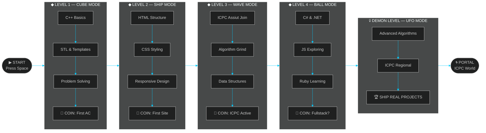

[README_GD.md](https://github.com/user-attachments/files/28841646/README_GD.md)
<!-- ════════════════════════════════════════════════════════════════════════════════════════ -->
<!--   ▓█████▄  ▄▄▄       ███████╗██╗  ██╗    ▄████▄   ██████╗ ██████╗ ███████╗         -->
<!--   ▒██▀ ██▌▒████▄     ██╔════╝██║  ██║   ██╔════╝ ██╔═══██╗██╔══██╗██╔════╝         -->
<!--   ░██   █▌▒██  ▀█▄   ███████╗███████║   ██║      ██║   ██║██║  ██║█████╗           -->
<!--   ░▓█▄   ▌░██▄▄▄▄██  ╚════██║██╔══██║   ██║      ██║   ██║██║  ██║██╔══╝           -->
<!--   ░▒████▓  ▓█   ▓██▒ ███████║██║  ██║   ╚██████╗ ╚██████╔╝██████╔╝███████╗         -->
<!--    ▒▒▓  ▒  ▒▒   ▓▒█░ ╚══════╝╚═╝  ╚═╝    ╚═════╝  ╚═════╝ ╚═════╝ ╚══════╝         -->
<!--                       GEOMETRY DASH EDITION — PRESS SPACE TO JUMP                  -->
<!-- ════════════════════════════════════════════════════════════════════════════════════════ -->

<div align="center">

<!-- ░░░░░░░░░░░░ GD NEON HEADER ░░░░░░░░░░░░ -->


<!-- ░░░░░░░░░░░░ GD PROGRESS BAR ░░░░░░░░░░░░ -->

```
▶  LEVEL: HAMZA.EXE  ───────────────────────────────────────────────────────  ██████████  100%
   ████████████████████████████████████████████████████████████████████████  [NORMAL MODE]
   ◆ COINS: ∞   ◆ ATTEMPTS: ∞   ◆ BEST: 100%   ◆ PRACTICE: كل يوم
```

<picture>
  
</picture>

</div>


---

<!-- ░░░░░░░░░░░░ GD LEVEL CARD ░░░░░░░░░░░░ -->

<div align="center">

## ◈ PLAYER STATS ◈

</div>

<table align="center" width="95%">
<tr>
<td width="48%" valign="top">

```
╔══════════════════════════════════════════╗
║  ◆ GEOMETRY DASH — PLAYER CARD ◆        ║
╠══════════════════════════════════════════╣
║                                          ║
║  PLAYER     →  Hamza Ahmed Kafafi        ║
║  LOCATION   →  المنيا، مصر 🇪🇶           ║
║  UNIVERSITY →  Minya Uni | IT           ║
║  GAMEMODE   →  Cube (CP) / Ship (Web)   ║
║                                          ║
║  ─────────────── STATS ─────────────── ║
║                                          ║
║  JUMPS      →  Codeforces Problems      ║
║  COINS      →  ACs Collected            ║
║  STARS      →  GitHub ⭐                 ║
║  DEMONS     →  Hard ICPC Problems       ║
║                                          ║
║  ─────────────── ICONS ─────────────── ║
║                                          ║
║  CUBE    ██  C++  SHIP   ◈◈  HTML/CSS  ║
║  BALL    ○○  C#   UFO    △△  Python    ║
║  WAVE    ≋≋  JS   ROBOT  ▣▣  Java      ║
║                                          ║
╚══════════════════════════════════════════╝
```

</td>
<td width="52%" valign="top">

```rust
// hamza.rs — GEOMETRY DASH EDITION

#[derive(Debug, Clone)]
struct Player {
    name:    "Hamza Ahmed Kafafi",
    mode:    GameMode::Cube,
    level:   "IT Student — Minya Uni 🇪🇬",
    status:  Status::Grinding,
}

impl Player {
    fn jump(&self) -> &str { "Space pressed → new problem" }
    fn die(&self)  -> &str { "WA → attempt++ → retry" }
    fn win(&self)  -> &str { "AC → coins++ → next level" }

    fn philosophy(&self) -> Vec<&str> {
        vec![
            "Simple > Clever",
            "Correct > Fast",
            "مفيش WA بلا سبب",
            "كل spike بتتعلم منه",
        ]
    }
}

fn main() {
    let hamza = Player { .. };
    loop { hamza.jump(); hamza.grind(); }
}
```

</td>
</tr>
</table>


---

<!-- ░░░░░░░░░░░░ GD PLATFORMER SKILL SECTION ░░░░░░░░░░░░ -->

<div align="center">

## ◈ SKILL PLATFORMER ◈

```
                  ▶ JUMP OVER SPIKES  ·  COLLECT COINS  ·  REACH THE PORTAL ◀
━━━━━━━━━━━━━━━━━━━━━━━━━━━━━━━━━━━━━━━━━━━━━━━━━━━━━━━━━━━━━━━━━━━━━━━━━━━━━━━━

  C++    [██████░░░░]  60%   ◆◆◆   WAVE MODE  →  ICPC Assiut · Algorithms · STL
  C#     [████░░░░░░]  40%   ◆◆    CUBE MODE  →  .NET Journey · OOP · Learning
  HTML   [██████░░░░]  60%   ◆◆◆   SHIP MODE  →  Semantic · Web Pages · Structure
  CSS    [██████░░░░]  60%   ◆◆◆   SHIP MODE  →  Responsive · Styling · Layouts
  Python [████░░░░░░]  35%   ◆◆    BALL MODE  →  Scripts · Automation · Basics
  Java   [███░░░░░░░]  30%   ◆◆    UFO MODE   →  OOP Concepts · Exploring
  JS     [███░░░░░░░]  25%   ◆     ROBOT MODE →  Unlocking... · Frontend
  Ruby   [██░░░░░░░░]  20%   ◆     NEW BEST   →  First Steps · Curious

━━━━━━━━━━━━━━━━━━━━━━━━━━━━━━━━━━━━━━━━━━━━━━━━━━━━━━━━━━━━━━━━━━━━━━━━━━━━━━━━
                ◆ = 1 COIN   ■■■ = ORBS UNLOCKED   ░ = TERRITORY AHEAD
```


</div>


---

<!-- ░░░░░░░░░░░░ GD LIVE CODEFORCES ░░░░░░░░░░░░ -->

<div align="center">

## ◈ CODEFORCES ARENA — LIVE FEED ◈

> 🔴 **LIVE** — Numbers fetched from Codeforces API on every page load

<a href="https://codeforces.com/profile/Hamza-Ahmed26">
  
</a>
&nbsp;
<a href="https://codeforces.com/profile/Hamza-Ahmed26">
  
</a>
&nbsp;
<a href="https://codeforces.com/profile/Hamza-Ahmed26">
  
</a>

<br/><br/>

```
   ▶  CODEFORCES JOURNEY — ATTEMPT LOG

   ATTEMPT 001  →  First submission  →  [ COMPILE ERROR ] → fix → [ AC ] ✓
   ATTEMPT 0XX  →  ICPC Sheet Grind  →  [ WA ] → debug → [ WA ] → think → [ AC ] ✓
   ATTEMPT ???  →  Hard Demon Level  →  [ TLE ] → optimize → [ AC ] ✓
   ATTEMPT NOW  →  Daily Grind Mode  →  ██████████████████████████ IN PROGRESS ▶
```

</div>


---

<!-- ░░░░░░░░░░░░ GD LEVEL MAP ░░░░░░░░░░░░ -->

<div align="center">

## ◈ THE LEVEL MAP ◈

</div>




---

<!-- ░░░░░░░░░░░░ GD MANIFESTO ░░░░░░░░░░░░ -->

<div align="center">

## ◈ THE SPIKE ROOM — CODE LAWS ◈

</div>

<table align="center" width="90%">
<tr><td>

```
▓▓▓▓▓▓▓▓▓▓▓▓▓▓▓▓▓▓▓▓▓▓▓▓▓▓▓▓▓▓▓▓▓▓▓▓▓▓▓▓▓▓▓▓▓▓▓▓▓▓▓▓▓▓▓▓▓▓▓▓▓▓▓▓▓▓▓▓▓▓▓▓▓
▓                                                                       ▓
▓  ▶ SPIKE 01 — ما تبعتش كود مش فاهمه                                  ▓
▓              Never ship code you can't explain line by line           ▓
▓                                                                       ▓
▓  ▶ SPIKE 02 — افهم المسألة قبل ما تفتح المحرر                        ▓
▓              Read the problem 3 times before touching the keyboard    ▓
▓                                                                       ▓
▓  ▶ SPIKE 03 — أبسط حل صح أحسن من أعقد حل ذكي                        ▓
▓              O(n log n) you understand > O(n) you can't explain       ▓
▓                                                                       ▓
▓  ▶ SPIKE 04 — الـ Performance مش extra — هي الأصل                    ▓
▓              Write for the judge. Then write for the human.           ▓
▓                                                                       ▓
▓  ▶ SPIKE 05 — كل WA بتتعلم منها — هي orb للأمام                     ▓
▓              Wrong Answer today. Correct mindset forever.             ▓
▓                                                                       ▓
▓  ▶ SPIKE 06 — ICPC problems = أصعب demon level ممكن تلعبه            ▓
▓              The real game has no skip button. No checkpoints.        ▓
▓                                                                       ▓
▓  ▶ SPIKE 07 — Simple > Clever. Correct > Fast. Shipped > Perfect.    ▓
▓              Press Space. Jump. Land. Repeat.                         ▓
▓                                                                       ▓
▓▓▓▓▓▓▓▓▓▓▓▓▓▓▓▓▓▓▓▓▓▓▓▓▓▓▓▓▓▓▓▓▓▓▓▓▓▓▓▓▓▓▓▓▓▓▓▓▓▓▓▓▓▓▓▓▓▓▓▓▓▓▓▓▓▓▓▓▓▓▓▓▓
```

</td></tr>
</table>


---

<!-- ░░░░░░░░░░░░ GITHUB METRICS ░░░░░░░░░░░░ -->

<div align="center">

## ◈ STATS SCREEN ◈

<picture>
  
</picture>
<picture>
  
</picture>

<br/><br/>


</div>


---

<!-- ░░░░░░░░░░░░ TROPHIES ░░░░░░░░░░░░ -->

<div align="center">

## ◈ TROPHY ROOM ◈

[](https://github.com/ryo-ma/github-profile-trophy)

</div>


---

<!-- ░░░░░░░░░░░░ GD ROADMAP ░░░░░░░░░░░░ -->

<div align="center">

## ◈ LEVEL PROGRESSION ◈

</div>

<table align="center" width="95%">
<tr>
<td width="33%" align="center" valign="top">

```
╔═══════════════════════╗
║  ✅ CLEARED LEVELS    ║
╠═══════════════════════╣
║  ◆ C++ Intermediate   ║
║  ◆ HTML + CSS (Lvl 2) ║
║  ◆ Java & Python Base ║
║  ◆ ICPC Assiut Active ║
║  ◆ Git + GitHub Flow  ║
║                       ║
║  COINS: ████████░░    ║
╚═══════════════════════╝
```

</td>
<td width="33%" align="center" valign="top">

```
╔═══════════════════════╗
║  ▶ CURRENT LEVELS     ║
╠═══════════════════════╣
║  ▶ C# & .NET Basics   ║
║  ▶ JS Exploring       ║
║  ▶ Ruby Learning      ║
║  ▶ CP Daily Grind     ║
║                       ║
║  PROGRESS: ████░░░░   ║
║  ATTEMPTS: ∞          ║
╚═══════════════════════╝
```

</td>
<td width="33%" align="center" valign="top">

```
╔═══════════════════════╗
║  💀 DEMON LEVELS      ║
╠═══════════════════════╣
║  ○ Adv. Algorithms    ║
║  ○ JS Frameworks      ║
║  ○ C# Advanced        ║
║  ○ ICPC Regional      ║
║  ○ Ship Real Projects ║
║                       ║
║  STATUS: 🔒 LOCKED    ║
╚═══════════════════════╝
```

</td>
</tr>
</table>


---

<!-- ░░░░░░░░░░░░ CONTRIBUTION SNAKE ░░░░░░░░░░░░ -->

<div align="center">

## ◈ CONTRIBUTION WAVE — GD WAVE MODE ◈

<picture>
  <source media="(prefers-color-scheme: dark)" srcset="https://raw.githubusercontent.com/hamza-ahmed26/hamza-ahmed26/output/github-contribution-grid-snake-dark.svg">
  <source media="(prefers-color-scheme: light)" srcset="https://raw.githubusercontent.com/hamza-ahmed26/hamza-ahmed26/output/github-contribution-grid-snake.svg">
  
</picture>

</div>


---

<!-- ░░░░░░░░░░░░ QUOTE ░░░░░░░░░░░░ -->

<div align="center">

## ◈ LOADING SCREEN QUOTE ◈


<br/><br/>

```
  ┌──────────────────────────────────────────────────────────────────────┐
  │                                                                      │
  │   GD TIP:  "Practice Mode doesn't count — ship real code."          │
  │   GD TIP:  "Every spike (WA) is just a checkpoint to learn from."   │
  │   GD TIP:  "The coin won't come to you — you jump for it."          │
  │   GD TIP:  "كن جميلاً ترى الوجود جميلاً — even in C++."            │
  │                                                                      │
  └──────────────────────────────────────────────────────────────────────┘
```

</div>


---

<!-- ░░░░░░░░░░░░ CONTACT ░░░░░░░░░░░░ -->

<div align="center">

## ◈ MULTIPLAYER — FIND ME HERE ◈

<picture>
  
</picture>

<br/><br/>

<table align="center">
<tr>
<td align="center" width="20%">
<a href="https://github.com/hamza-ahmed26">
<br/>
<b>GitHub</b><br/>
<sub>Code Portfolio</sub>
</a>
</td>
<td align="center" width="20%">
<a href="https://www.linkedin.com/in/hamza-kafafi/">
<br/>
<b>LinkedIn</b><br/>
<sub>Professional</sub>
</a>
</td>
<td align="center" width="20%">
<a href="https://codeforces.com/profile/Hamza-Ahmed26">
<br/>
<b>Codeforces</b><br/>
<sub>CP Arena</sub>
</a>
</td>
<td align="center" width="20%">
<a href="mailto:hamza070626ahmed0195ultmate@gmail.com">
<br/>
<b>Gmail</b><br/>
<sub>Direct Line</sub>
</a>
</td>
<td align="center" width="20%">
<a href="https://x.com/Ham70211Kafafi">
<br/>
<b>X / Twitter</b><br/>
<sub>@Ham70211Kafafi</sub>
</a>
</td>
</tr>
</table>

<br/>

[](https://link.chess.com/friend/ait395)
&nbsp;
[](https://www.reddit.com/user/hamza-ahmed26/)
&nbsp;
[](https://www.tiktok.com/@hamza26_kafafi)

</div>

---

<!-- ░░░░░░░░░░░░ GD FOOTER ░░░░░░░░░░░░ -->

<div align="center">

```
▓▓▓▓▓▓▓▓▓▓▓▓▓▓▓▓▓▓▓▓▓▓▓▓▓▓▓▓▓▓▓▓▓▓▓▓▓▓▓▓▓▓▓▓▓▓▓▓▓▓▓▓▓▓▓▓▓▓▓▓▓▓▓▓▓▓▓▓▓▓▓
▓                                                                     ▓
▓   ▶  ALWAYS LEARNING · ALWAYS BUILDING · ALWAYS JUMPING            ▓
▓   ◆  Simple > Clever  ·  Correct > Fast  ·  Shipped > Perfect      ▓
▓   🇪🇬  المنيا · Minya University · IT Student · ICPC Fighter       ▓
▓                                                                     ▓
▓   "Press Space. Jump. Land. Repeat. That's the game."              ▓
▓                                                                     ▓
▓▓▓▓▓▓▓▓▓▓▓▓▓▓▓▓▓▓▓▓▓▓▓▓▓▓▓▓▓▓▓▓▓▓▓▓▓▓▓▓▓▓▓▓▓▓▓▓▓▓▓▓▓▓▓▓▓▓▓▓▓▓▓▓▓▓▓▓▓▓▓
```


</div>
