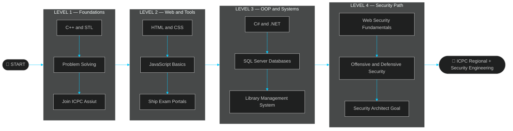

<div align="center">


<h1 align="center">

Hi there, I'm Hamza

</h1>

<picture>
  
</picture>

<br/>

**📑 Quick Navigation:** [About](#about-me) · [Tech Stack](#tech-stack) · [Featured Project](#-featured-project) · [Competitive Programming](#competitive-programming) · [Journey Map](#journey-map) · [Code Manifesto](#code-manifesto) · [GitHub Stats](#github-stats) · [Level Progression](#level-progression) · [Daily Quote](#daily-quote) · [Connect](#connect-with-me)

</div>


## About Me

- 🎓 IT student at **Minya University**, Faculty of Science — coursework spanning C#, C++, databases, and applied math/science
- 🏆 Competitive programmer with **ICPC Assiut**, grinding algorithms and data structures daily
- 🔐 Long-term goal: **Security Architect / Offensive & Defensive Security Engineer**
- 🛠️ Currently building a **C# Library Management System** as part of an OOP course project
- 📚 Maintains a suite of single-file, offline-first **exam and study portals** (C++, Math, Physics, Chemistry) for classmates — fully in Arabic
- 🤝 Frequently collaborates with **Ahmed Anwar** on shared web projects
- ⚡ Simple > Clever · Correct > Fast · Shipped > Perfect
- 📫 Reach me on any of the platforms below

<table align="center" width="95%">
<tr>
<td width="48%" valign="top">

```
╔══════════════════════════════════════════╗
║           ◆ PLAYER CARD ◆               ║
╠══════════════════════════════════════════╣
║  PLAYER     →  Hamza Ahmed               ║
║  LOCATION   →  Minya, Egypt 🇪🇬          ║
║  UNIVERSITY →  Minya Uni · IT Dept       ║
║  MODE       →  Cube (CP) / Ship (Web)    ║
║                                          ║
║  ────────────── STATS ────────────────  ║
║  JUMPS      →  Codeforces Problems       ║
║  COINS      →  ACs Collected             ║
║  STARS      →  GitHub ⭐                  ║
║  DEMONS     →  Hard ICPC Problems        ║
║                                          ║
║  ────────────── ICONS ─────────────────  ║
║  CUBE  ██  C++     SHIP  ◈◈  HTML/CSS   ║
║  BALL  ○○  C#      UFO   △△  Python     ║
║  WAVE  ≋≋  JS       ROBOT ▣▣  Java       ║
╚══════════════════════════════════════════╝
```

</td>
<td width="52%" valign="top">

```rust
// hamza.rs

#[derive(Debug, Clone)]
struct Hamza {
    role:   "IT Student & Competitive Programmer",
    base:   "Minya, Egypt 🇪🇬",
    focus:  vec!["Cybersecurity", "Competitive Programming", "Web Dev"],
    status: Status::Grinding,
}

impl Hamza {
    fn jump(&self) -> &str { "new problem opened" }
    fn die(&self)  -> &str { "WA → attempt++ → retry" }
    fn win(&self)  -> &str { "AC → next problem" }

    fn philosophy(&self) -> Vec<&str> {
        vec![
            "Simple > Clever",
            "Correct > Fast",
            "مفيش WA بلا سبب",
            "كل مشكلة بتتعلم منها حاجة",
        ]
    }
}

fn main() {
    loop { hamza.jump(); hamza.build(); }
}
```

</td>
</tr>
</table>


## Tech Stack

<p align="left">
  
</p>

```
  C++    [██████░░░░]  60%   ◆◆◆   ICPC Assiut · Algorithms · STL
  C#     [████░░░░░░]  40%   ◆◆    .NET Journey · OOP · Learning
  HTML   [██████░░░░]  60%   ◆◆◆   Semantic · Web Pages · Structure
  CSS    [██████░░░░]  60%   ◆◆◆   Responsive · Styling · Layouts
  SQL    [████░░░░░░]  40%   ◆◆    SQL Server · Core Fundamentals
  Python [████░░░░░░]  35%   ◆◆    Scripts · Automation · Basics
  Java   [███░░░░░░░]  30%   ◆◆    OOP Concepts · Exploring
  JS     [███░░░░░░░]  25%   ◆     Frontend · Unlocking
```

**Currently sharpening:** C++ (STL, algorithms) · C# / .NET (OOP) · SQL Server · JavaScript basics


## 🚀 Featured Project

<table align="center" width="90%">
<tr>
<td width="100%" valign="top">

<div align="center">


### 📚 Library Management System — C# / OOP

</div>

> Sprint 1 project applying core OOP principles (Encapsulation, Inheritance, Polymorphism, Abstraction) built as part of university coursework under Dr. Ali Ali Satouhi.

**Highlights:**
- 🏗️ Clean class architecture (`Book`, `Member`, `Library`, `Transaction`)
- 🔄 Full CRUD operations for books & members
- 📖 Borrow/Return logic with validation rules
- 🎯 Built to reinforce OOP fundamentals hands-on

<p align="center">


</p>

<a href="https://github.com/hamza-ahmed26/library-management-system" target="_blank">
  
</a>

</td>
</tr>
</table>


## Competitive Programming

<div align="center">

> 🔴 **LIVE** — badges below pull live data from the Codeforces API on every page load

<a href="https://codeforces.com/profile/Hamza-Ahmed26">
  
</a>
&nbsp;
<a href="https://codeforces.com/profile/Hamza-Ahmed26">
  
</a>
&nbsp;
<a href="https://codeforces.com/profile/Hamza-Ahmed26">
  
</a>

```
   ATTEMPT LOG

   001  →  First submission     →  [ COMPILE ERROR ] → fix     → [ AC ] ✓
   0XX  →  ICPC Sheet Grind     →  [ WA ] → debug → [ WA ] → think → [ AC ] ✓
   ???  →  Hard Problem         →  [ TLE ] → optimize           → [ AC ] ✓
   NOW  →  Daily Grind Mode     →  ████████████████████ IN PROGRESS ▶
```

</div>


## Journey Map


```mermaid
%%{init: {'theme':'dark','themeVariables':{'primaryColor':'#00ffcc','primaryTextColor':'#ffffff','primaryBorderColor':'#00ffcc','lineColor':'#00ccff','secondaryColor':'#0d0d2b','tertiaryColor':'#0d0d2b','edgeLabelBackground':'#0d0d2b'}}}%%
flowchart LR
    START(["🚀 START"])
    START --> L1

    subgraph L1["LEVEL 1 — Foundations"]
        direction TB
        A1["C++ and STL"] --> A2["Problem Solving"]
        A2 --> A3["Join ICPC Assiut"]
    end

    subgraph L2["LEVEL 2 — Web and Tools"]
        direction TB
        B1["HTML and CSS"] --> B2["JavaScript Basics"]
        B2 --> B3["Ship Exam Portals"]
    end

    subgraph L3["LEVEL 3 — OOP and Systems"]
        direction TB
        C1["C# and .NET"] --> C2["SQL Server Databases"]
        C2 --> C3["Library Management System"]
    end

    subgraph L4["LEVEL 4 — Security Path"]
        direction TB
        D1["Web Security Fundamentals"] --> D2["Offensive and Defensive Security"]
        D2 --> D3["Security Architect Goal"]
    end

    L1 --> L2 --> L3 --> L4 --> GOAL(["🏁 ICPC Regional + Security Engineering"])
```


## Code Manifesto

<table align="center" width="92%">
<tr><td>

```
▓▓▓▓▓▓▓▓▓▓▓▓▓▓▓▓▓▓▓▓▓▓▓▓▓▓▓▓▓▓▓▓▓▓▓▓▓▓▓▓▓▓▓▓▓▓▓▓▓▓▓▓▓▓▓▓▓▓▓▓▓▓▓▓▓▓▓▓▓▓▓▓▓
▓                                                                       ▓
▓  01 — ما تبعتش كود مش فاهمه                                          ▓
▓       Never ship code you can't explain line by line                 ▓
▓                                                                       ▓
▓  02 — افهم المسألة قبل ما تفتح المحرر                                ▓
▓       Read the problem twice before touching the keyboard             ▓
▓                                                                       ▓
▓  03 — أبسط حل صح أحسن من أعقد حل ذكي                                ▓
▓       O(n log n) you understand > O(n) you can't explain              ▓
▓                                                                       ▓
▓  04 — كل WA بتتعلم منها حاجة                                        ▓
▓       Wrong Answer today. Correct mindset forever.                    ▓
▓                                                                       ▓
▓  05 — Simple > Clever · Correct > Fast · Shipped > Perfect           ▓
▓       Build it. Test it. Ship it. Repeat.                             ▓
▓                                                                       ▓
▓▓▓▓▓▓▓▓▓▓▓▓▓▓▓▓▓▓▓▓▓▓▓▓▓▓▓▓▓▓▓▓▓▓▓▓▓▓▓▓▓▓▓▓▓▓▓▓▓▓▓▓▓▓▓▓▓▓▓▓▓▓▓▓▓▓▓▓▓▓▓▓▓
```

</td></tr>
</table>


## GitHub Stats

<table>
  <tr>
    <td width="50%" valign="top">
      
      <br/>
      
      <br/>
      
    </td>
    <td width="50%" valign="center">
      
    </td>
  </tr>
</table>

<p align="center">
  
</p>

<div align="center">

[](https://github.com/ryo-ma/github-profile-trophy)

<picture>
  <source media="(prefers-color-scheme: dark)" srcset="https://raw.githubusercontent.com/hamza-ahmed26/hamza-ahmed26/output/github-contribution-grid-snake-dark.svg">
  <source media="(prefers-color-scheme: light)" srcset="https://raw.githubusercontent.com/hamza-ahmed26/hamza-ahmed26/output/github-contribution-grid-snake.svg">
  
</picture>

<br/>


</div>


## Level Progression

<table align="center" width="95%">
<tr>
<td width="33%" align="center" valign="top">

```
╔═══════════════════════╗
║  ✅ CLEARED LEVELS    ║
╠═══════════════════════╣
║  ◆ C++ Intermediate   ║
║  ◆ HTML + CSS         ║
║  ◆ Java & Python Base ║
║  ◆ ICPC Assiut Active ║
║  ◆ Git + GitHub Flow  ║
║                       ║
║  COINS: ████████░░    ║
╚═══════════════════════╝
```

</td>
<td width="33%" align="center" valign="top">

```
╔═══════════════════════╗
║  ▶ CURRENT LEVELS     ║
╠═══════════════════════╣
║  ▶ C# & .NET OOP      ║
║  ▶ SQL Server         ║
║  ▶ Library Mgmt Sys.  ║
║  ▶ CP Daily Grind     ║
║                       ║
║  PROGRESS: ████░░░░   ║
║  ATTEMPTS: ∞          ║
╚═══════════════════════╝
```

</td>
<td width="33%" align="center" valign="top">

```
╔═══════════════════════╗
║  🔒 LOCKED LEVELS     ║
╠═══════════════════════╣
║  ○ Adv. Algorithms    ║
║  ○ Offensive Security ║
║  ○ Defensive Security ║
║  ○ ICPC Regional      ║
║  ○ Security Architect ║
║                       ║
║  STATUS: LOCKED       ║
╚═══════════════════════╝
```

</td>
</tr>
</table>


## Daily Quote

<div align="center">
  
</div>


## Connect With Me

<div align="center">

<picture>
  
</picture>

<br/><br/>

<a href="https://github.com/hamza-ahmed26" target="_blank"></a>&nbsp;
<a href="https://linkedin.com/in/hamza-kafafi" target="_blank"></a>&nbsp;
<a href="https://codeforces.com/profile/Hamza-Ahmed26" target="_blank"></a>&nbsp;
<a href="https://www.codechef.com/users/hamza_ahmed26" target="_blank"></a>&nbsp;
<a href="https://www.leetcode.com/hamza-ahmed26" target="_blank"></a>&nbsp;
<a href="mailto:hamza070626ahmed0195ultmate@gmail.com"></a>&nbsp;
<a href="https://x.com/Ham70211Kafafi" target="_blank"></a>&nbsp;
<a href="https://fb.com/ha.ka.899617" target="_blank"></a>&nbsp;
<a href="https://instagram.com/hamza_2k6_kafafi" target="_blank"></a>

<br/><br/>

[](https://link.chess.com/friend/ait395)
&nbsp;
[](https://www.reddit.com/user/hamza-ahmed26/)
&nbsp;
[](https://www.tiktok.com/@hamza26_kafafi)

</div>

<br/>

<div align="center">

```
▓▓▓▓▓▓▓▓▓▓▓▓▓▓▓▓▓▓▓▓▓▓▓▓▓▓▓▓▓▓▓▓▓▓▓▓▓▓▓▓▓▓▓▓▓▓▓▓▓▓▓▓▓▓▓▓▓▓▓▓▓▓▓▓▓▓▓▓▓▓▓
▓  ALWAYS LEARNING · ALWAYS BUILDING · ALWAYS GRINDING                ▓
▓  Simple > Clever · Correct > Fast · Shipped > Perfect               ▓
▓  🇪🇬  Minya · Minya University · IT Student · ICPC Fighter          ▓
▓▓▓▓▓▓▓▓▓▓▓▓▓▓▓▓▓▓▓▓▓▓▓▓▓▓▓▓▓▓▓▓▓▓▓▓▓▓▓▓▓▓▓▓▓▓▓▓▓▓▓▓▓▓▓▓▓▓▓▓▓▓▓▓▓▓▓▓▓▓▓
```


</div>
